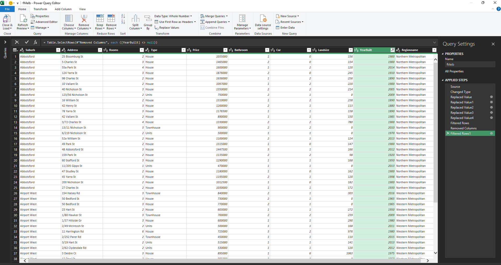

# Melbourne-Housing-Market

## Objective
Conduct analysis to surface insights on property value trends for Melbourne-based real estate dataset containing over 8000 records. Excel was used to clean and analyse data before using Power BI to create a performance dashboard to visualise trends related to property price, regional differences and key factors that affect it. Insights and recommendations geared towards potential property investors and developers to make informed decisions.  

### Tools used:

| Excel    | For data cleaning, exploration                           |
| Power BI | For creating interactive dashboards and visualising data |

## Data Cleaning and Exploration
The data was imported from the following dataset. Excel was used to clean data by removing unnecessary columns, checking for proper value formats, checking for missing values, duplicates, and inconsistencies.

## Data Visualisation

## Results
It was identified that suburbs closer to the CBD commanded significantly higher property prices than suburbs further away. Other factors that affect property prices were the amount of rooms and land size, as there was positive correlation between small land size and small rooms leading to higher prices. However, this was likely due to higher prices being closer to the CBD where there is less room for development as filters to suburbs within a region showed little correlation between prices and land size, and room size; suggesting that other factors impacted prices. Furthermore, It seems overall that newer properties demand lower prices than older ones. Certain regions show negative or no correlation. 

## Recommendations
Investing in suburbs close to the CBD, those showing consistent price growth in recent years such as the South-Eastern Metropolitano area could offer higher returns. Furthermore properties with historical significance tend to offer better resale value. 

For developers, suburbs further away from the city are demanding higher prices for recently built property. Suggesting that these regions are emerging markets with growth potential.
